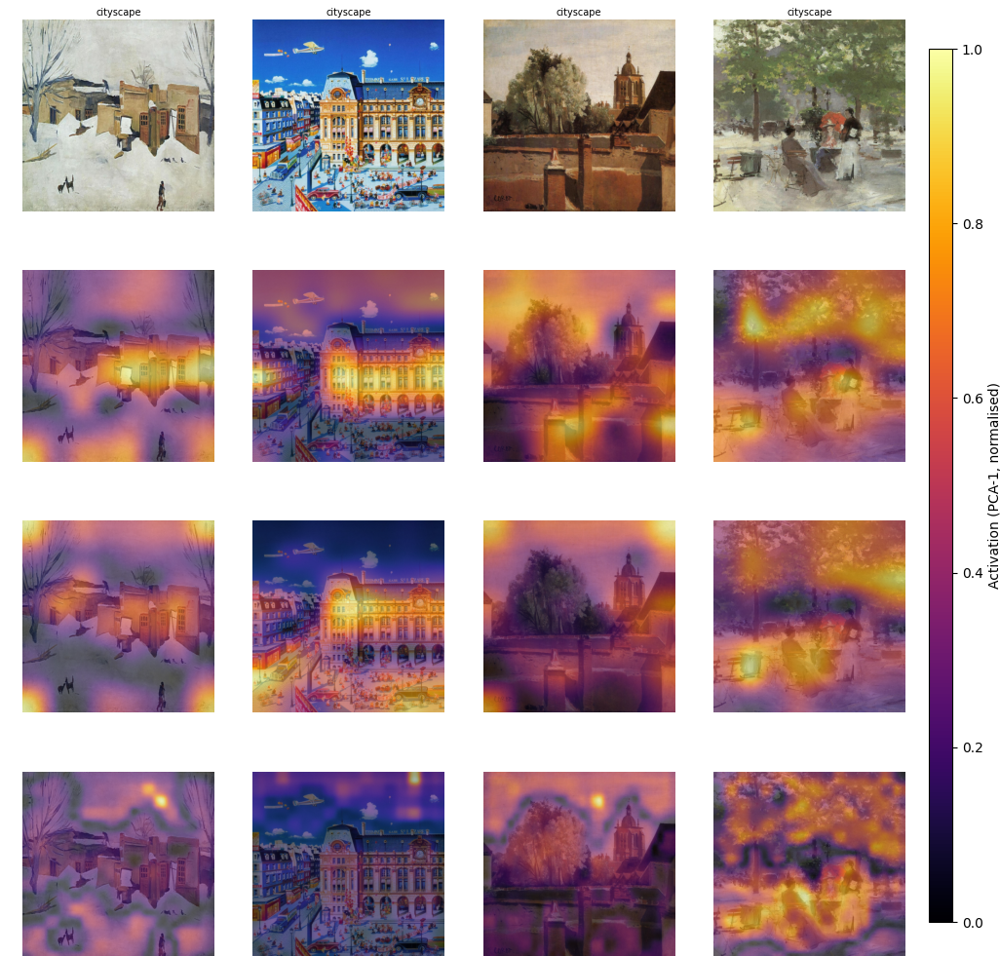

# WikiArtClassifySD : Painting Classification via Diffusion Features

Classifies WikiArt paintings by style, artist, and genre using internal activations
from a Stable Diffusion UNet as features, rather than training a vision model from scratch.


*PCA of SD U-Net activations at three layers — the model localises semantically meaningful
regions (buildings, sky, figures) without any spatial supervision. Row 0: original painting.
Rows 1–3: down_blocks.2 → mid_block → up_blocks.1.*

The core idea: an SD model fine-tuned on WikiArt (`valhalla/sd-wikiart-v2`) has already
learned rich representations of painting texture, brushwork, and composition. We extract
those representations at a fixed noise timestep and train lightweight classifiers on top —
a Conv-LSTM that reasons spatially over the feature map, an MLP linear probe, and a
ResNet50 fine-tune as a baseline.

## Results

All models trained with class-weighted loss on 150 images/class. Artist top-5 accuracy
is the primary metric there given 129 classes.

| Model | Features | Style acc | Style F1 | Artist acc | Artist top-5 | Genre acc | Genre F1 |
|---|---|---|---|---|---|---|---|
| ResNet50 | raw pixels | 0.613 | 0.618 | 0.740 | 0.908 | 0.667 | 0.662 |
| MLP probe | SD pooled (3840-d) | 0.648 | 0.658 | 0.709 | 0.902 | 0.718 | 0.709 |
| ConvLSTM | SD spatial (16×16) | 0.550 | 0.563 | 0.581 | 0.805 | 0.655 | 0.637 |

A few things worth noting: the MLP probe outperforms ResNet50 on genre and is competitive
on style — just a linear layer on top of frozen SD features. The ConvLSTM underperforms
the MLP here likely because spatial reasoning over 256 tokens needs more data than
150/class to converge; at full dataset scale the gap should close. An earlier run without
class weighting showed convlstm_artist at 0.603 top-1 / 0.816 top-5, confirming the
spatial model does benefit from seeing more of the rare classes.

## Setup

```bash
pip install -r requirements.txt
```

## Replicating results

**Step 1 — get the data**

Images are sourced from `huggan/wikiart` on HuggingFace. Download them to
`data/wikiart/`, then build the CSV splits:

```bash
python src/download_data.py --images-per-class 150
```

Pass `--images-per-class None` to use the full 81K dataset instead of the
default 150/class subsample.

**Step 2 — extract activations**

Single SD forward pass per image at t=200, hooking `down_blocks.2`, `mid_block`,
and `up_blocks.1`. Results cached to `activations/{task}_{split}.h5`. Only needs
to run once.

```bash
python src/extract_activations.py
```

**Step 3 — train**

```bash
python src/train.py                                      # all models, all tasks
python src/train.py --model convlstm --task style        # specific combo
python src/train.py --model resnet50 --task artist genre
```

Checkpoints saved to `results/checkpoints/{model}_{task}/best.pt`.
Pre-trained checkpoints: https://huggingface.co/Harish-JHR/WikiArtClassifySD

**Step 4 — evaluate**

```bash
python src/evaluate.py --model convlstm --task style artist genre
```

Saves confusion matrices and UMAP embedding plots to `results/eval/`. Pass
`--no-wandb` to skip W&B and write everything locally.

## Config

All hyperparameters are in `src/config.py`. The ones you're most likely to touch:

```python
images_per_class = 150     # reduce for quick experiments
timestep         = 200     # SD noise level for feature extraction
hook_layers      = ["down_blocks.2", "mid_block", "up_blocks.1"]
epochs           = 30
lr               = 3e-4
batch_size       = 32
```

## Models

**ConvLSTM** — the main model. Treats the 16×16 SD feature map as a sequence of
256 spatial tokens, runs a bidirectional LSTM over them, and uses learned attention
pooling to aggregate before classification.

**MLP probe** — global-average-pools the activations to a 3840-d vector and runs
a small MLP. Useful as a quick sanity check on feature quality.

**ResNet50** — standard ImageNet-pretrained ResNet50 fine-tuned on raw paintings.
Serves as the baseline that doesn't use diffusion features.

## W&B

All training runs log to project `artextract-task1`. Pass `--no-wandb` to any
script to fall back to local CSV + matplotlib in `results/logs/`.
